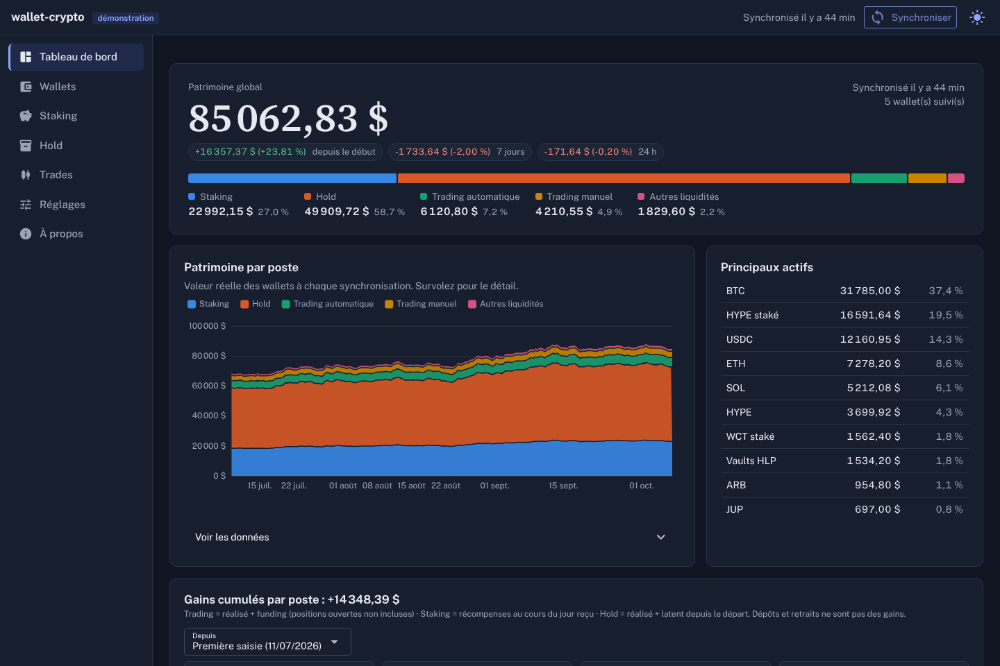
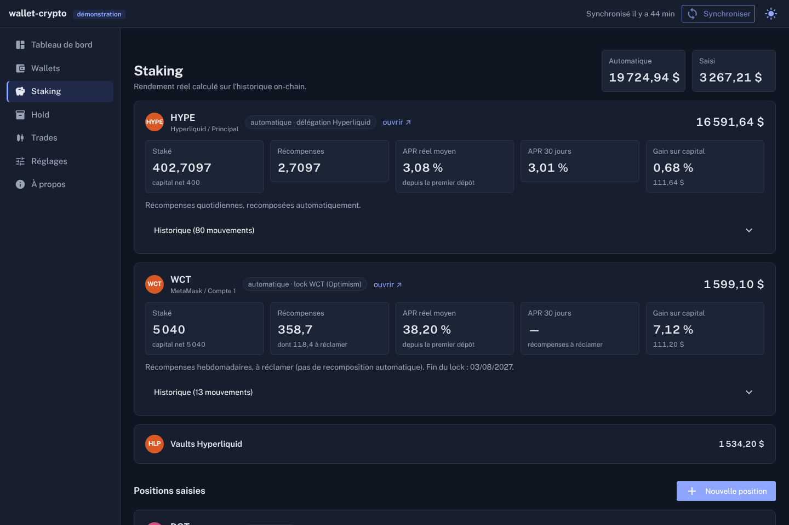
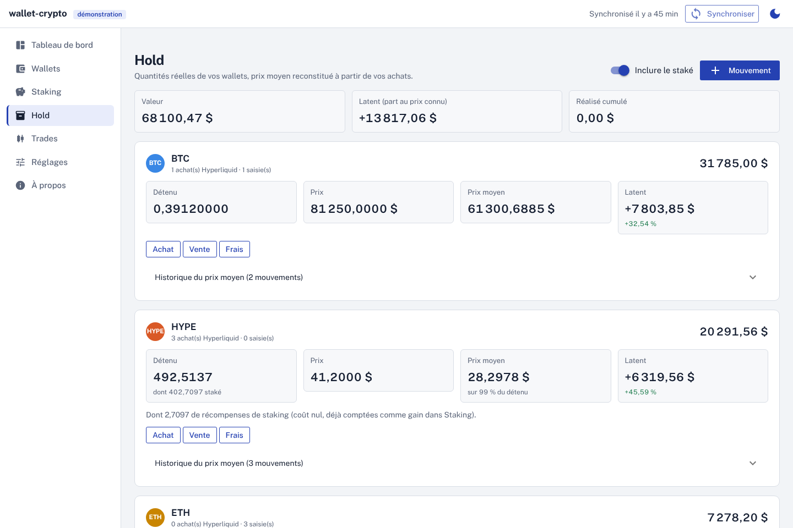

# wallet-crypto

**Tout votre patrimoine crypto sur un seul écran, chez vous.** Soldes réels de vos wallets Hyperliquid, EVM, Solana et Bitcoin, staking avec rendement réel, prix moyen d'achat de votre hold, trades Hyperliquid avec statistiques nettes de frais et de funding.

[](https://github.com/Patart50/wallet-crypto/actions/workflows/ci.yml)
[](LICENSE)



- 🔒 **Lecture seule.** Uniquement des adresses publiques. Jamais de clé privée, jamais de phrase de récupération : l'outil les refuse si vous en collez une par erreur.
- 🏠 **Auto-hébergé.** L'application tourne sur votre machine. Vos données restent dans un dossier `data/` que vous contrôlez. Aucune télémétrie, aucun compte.
- 🔑 **Votre propre clé API.** Seule une clé Alchemy gratuite est nécessaire (pour EVM et Solana). Chacun utilise la sienne : guide pas à pas ci-dessous, et dans l'application.
- 🇫🇷 En français, pour utilisateurs avertis à l'aise avec un terminal ou Docker.

> **Version 0.2 (jalon J2).** Interface web complète, Docker, démonstration. La v1.0 (J3) ajoutera les migrations de base et une revue de sécurité ; en attendant, exportez votre base avant chaque mise à jour.

## Essayer sans rien configurer

```bash
pip install git+https://github.com/Patart50/wallet-crypto
wallet-crypto serve --demo
```

Ouvrez http://127.0.0.1:8090 : un patrimoine entièrement **fictif**, aucune adresse, aucune API contactée.

## Installation

### Avec Docker (recommandé)

```bash
git clone https://github.com/Patart50/wallet-crypto
cd wallet-crypto
mkdir -p data
cp .env.example .env          # facultatif : clé Alchemy, mot de passe
docker compose up -d
```

L'interface est sur http://127.0.0.1:8090. Le port n'est publié que sur cette machine. Le conteneur tourne sans privilèges, avec un système de fichiers en lecture seule, et vos données sont dans `./data`.

### Avec Python 3.11 ou plus récent

```bash
git clone https://github.com/Patart50/wallet-crypto
cd wallet-crypto
python3 -m venv .venv && source .venv/bin/activate    # Windows : .venv\Scripts\activate
pip install .
wallet-crypto serve
```

Ensuite, tout se fait dans l'interface. Dans **Wallets**, ajoutez vos adresses publiques. Dans **Réglages**, collez votre clé Alchemy. Puis cliquez sur **Synchroniser**. Les synchronisations suivantes sont automatiques, toutes les 6 heures par défaut, tant que l'application tourne.

## Obtenir votre clé Alchemy

Alchemy fournit les soldes et les prix des tokens EVM et Solana. Le compte est gratuit. **Sans clé, Hyperliquid et Bitcoin fonctionnent quand même** ; seuls les wallets EVM, Solana et le staking WCT sont désactivés.

1. Créez un compte sur [dashboard.alchemy.com](https://dashboard.alchemy.com) (forfait gratuit).
2. Cliquez sur **Create new app**. Donnez-lui un nom, par exemple `wallet-crypto`.
3. Dans les réseaux de l'app, activez : **Ethereum**, **Arbitrum**, **Base**, **BNB Smart Chain**, **Polygon**, **Optimism** et **Solana** (mainnet pour chacun). Un réseau non activé renvoie une erreur partielle, signalée dans le journal.
4. Ouvrez l'app et copiez l'**API Key**.
5. Collez-la dans **Réglages → Clé Alchemy**. Ou bien dans le fichier `.env`, qui reste prioritaire :
   ```
   ALCHEMY_API_KEY=votre_cle_ici
   ```

**Consommation.** Une synchronisation fait une poignée d'appels par wallet EVM ou Solana : soldes multi-chaînes, et lecture du staking WCT s'il est suivi. Avec quatre synchronisations par jour, un usage personnel reste très loin des limites du forfait gratuit.

**Sécurité de la clé.** Elle ne donne accès à aucun fonds : elle sert seulement à lire des données publiques de la blockchain. Mais elle est personnelle : ne la publiez pas, ne commitez jamais le fichier `.env` (il est ignoré par Git). Si elle fuit, régénérez-la dans le tableau de bord Alchemy. L'outil ne l'écrit jamais en clair dans ses journaux.

## Ce que fait l'outil

| | |
|---|---|
| **Patrimoine** | Somme des soldes **réels** de vos wallets, sans double comptage : liquidités, hold, staking. Évolution depuis votre premier relevé, sur 7 jours et sur 24 heures. Composition par poste (staking, hold, trading automatique, trading manuel). |
| **Hyperliquid** | Compte unifié ou standard détecté automatiquement, positions ouvertes, spot, vaults, délégation HYPE. Valeur recoupée avec celle affichée par Hyperliquid. |
| **Staking** | HYPE délégué (Hyperliquid) et WCT locké (WalletConnect, Optimism) suivis automatiquement : capital, récompenses, **APR réel** calculé sur l'historique. Staking d'autres plateformes saisi à la main. |
| **Hold** | Prix moyen d'achat reconstitué à partir de vos achats spot Hyperliquid (frais déduits) et de vos achats saisis ailleurs. Latent, réalisé, historique du prix moyen, alertes en cas d'incohérence. |
| **Trades** | Trades Hyperliquid reconstruits à partir des fills (renforts, réductions, retournements). Winrate, profit factor, espérance, toujours **nets de frais et de funding**. Historique archivé localement, car Hyperliquid n'en garde que 10 000. Trades d'autres plateformes saisis à la main. |
| **Gains** | Gains cumulés par poste depuis la date de votre choix. Les récompenses sont valorisées au cours du jour où vous les avez reçues. |

<p>
  
  
</p>

Ce qu'il ne fait pas : signer ou envoyer des transactions, se connecter à une plateforme centralisée (prévu plus tard), calculer vos impôts. Pour la déclaration fiscale française, utilisez [pmpa-crypto](https://github.com/Patart50/pmpa-crypto).

## Accès depuis un autre appareil

Par défaut, l'interface n'écoute que sur la machine locale (`127.0.0.1`), car elle affiche tout votre patrimoine. Pour y accéder depuis votre téléphone ou un autre ordinateur, un **mot de passe est obligatoire**. Sans mot de passe, `wallet-crypto serve --host 0.0.0.0` refuse de démarrer.

```bash
WALLET_CRYPTO_PASSWORD='une phrase longue' wallet-crypto serve --host 0.0.0.0
```

Le mot de passe peut aussi se définir dans **Réglages → Accès**. Avec Docker, ajoutez `WALLET_CRYPTO_PASSWORD` dans `.env` avant de modifier la ligne `ports` de `docker-compose.yml`. Hors de votre réseau local, passez par un VPN ou un tunnel chiffré plutôt que d'exposer le port sur Internet.

## Ligne de commande

Pour un serveur sans interface, ou pour automatiser :

```bash
wallet-crypto wallet add HL,EVM 0xVotreAdresse --group "MetaMask" --label "Compte 1"
wallet-crypto wallet add HL 0xAdresseDuBot --label "Bot" --auto-trading   # sépare trading automatique et manuel
wallet-crypto sync            # lit tous les wallets, archive l'historique, enregistre un relevé
wallet-crypto status --eur    # patrimoine d'après la dernière synchronisation
wallet-crypto trades          # statistiques des trades Hyperliquid
wallet-crypto about           # version, dossier des données, clé masquée
```

Sans l'interface, une tâche cron fait la synchronisation : `*/30 * * * * cd /chemin/wallet-crypto && .venv/bin/wallet-crypto sync --if-due`. Deux synchronisations ne tournent jamais en même temps.

## Vos données

- Tout est dans `data/` : la base `wallet-crypto.db` (SQLite) et les journaux `logs/`. **Sauvegarder = copier ce dossier**, ou utiliser **Réglages → Exporter la base**.
- Les adresses que vous suivez sont envoyées aux services qui fournissent leurs soldes : Hyperliquid, Alchemy, mempool.space. C'est inhérent à l'outil. Les prix viennent des API publiques de Binance et de Hyperliquid, qui ne reçoivent que des noms de paires.
- Rien d'autre ne quitte votre machine. L'interface ne charge aucune ressource externe : polices, scripts et icônes sont servis par l'application.

| Réseau | Source | Clé |
|---|---|---|
| Hyperliquid | API publique Hyperliquid | aucune |
| EVM (Ethereum, Arbitrum, Base, BSC, Polygon, Optimism) | Alchemy | la vôtre |
| Staking WCT (Optimism) | Alchemy (lecture du contrat, appel simulé : rien n'est signé) | la vôtre |
| Solana | Alchemy | la vôtre |
| Bitcoin | mempool.space (une adresse, pas de xpub) | aucune |
| Prix courants et historiques | Binance, puis Hyperliquid | aucune |

## Méthode

- **Montants exacts** : tous les calculs sont faits en décimal exact (`Decimal`, 50 chiffres), jamais en virgule flottante. Les réponses des API sont lues en décimal dès la réception.
- **Patrimoine** : chaque actif n'existe que dans une ligne d'un wallet. Le hold et le staking sont des vues de ces lignes, jamais ajoutées en plus. Un staking saisi à la main sur un actif déjà suivi automatiquement est exclu et signalé.
- **APR réel** : récompenses ÷ solde staké moyen pondéré par le temps, annualisé. Une récompense WCT réclamée puis re-lockée n'est pas comptée comme capital neuf.
- **Prix moyen** : coût moyen pondéré. Une vente ne modifie pas le prix moyen. Des frais de transfert payés en token font sortir la quantité mais gardent le coût.
- **Trades** : net = PnL de prix − frais + funding. Un trade gagnant en brut mais perdant après frais compte comme une perte.

Le détail des conventions est consigné dans [docs/DECISIONS.md](docs/DECISIONS.md), la spécification dans [docs/SPEC.md](docs/SPEC.md).

## Limites connues

- Le patrimoine n'est connu qu'à partir de votre première synchronisation : pas de reconstitution du passé.
- L'évolution du patrimoine est brute : elle inclut vos dépôts et retraits.
- Hyperliquid ne fournit que les 10 000 derniers fills : un trade ouvert avant est marqué « incomplet ».
- Les tokens sans prix chez Alchemy sont ignorés (presque toujours du spam d'airdrop), comme la poussière de moins de 1 $.
- Prix historiques à la journée (clôture UTC) ; un actif sans historique est exclu du graphique des gains, et signalé.
- Pas de plateforme centralisée (Binance, Coinbase…) pour l'instant : l'architecture est prête à les accueillir.

## Développement

```bash
pip install -e ".[dev]"
ruff check src tests && ruff format --check src tests
pytest
wallet-crypto serve --demo
```

Les tests n'utilisent que des réponses d'API fictives (`tests/fixtures/`) et la base de démonstration. Ne commitez jamais d'adresse, de clé ou de donnée réelle.

Une nouvelle plateforme s'ajoute en écrivant une classe `Source` dans `src/wallet_crypto/sources/` et en la déclarant avec `@register` : voir `sources/base.py`.

## Auteur et soutien

Créé par [Arnaud (Patart50)](https://github.com/Patart50). wallet-crypto est gratuit et open source. Si l'outil vous est utile, vous pouvez soutenir son développement :

- [GitHub Sponsors](https://github.com/sponsors/Patart50)
- **Bitcoin** (réseau Bitcoin uniquement) : `bc1qd5j0yrrxp6wrk5ds0xne97hdrz5fvxjl8q22p4`
- **Ethereum et réseaux EVM** (Ethereum, Arbitrum, Optimism, Base…) : `0x7e4b6bad06813506b724b5ea3cc9545a7b97eba4`

Ces adresses sont dédiées aux dons. Leur somme de contrôle est vérifiée à chaque modification du code. Les QR codes sont dans l'application, page « À propos ».

Projets frères : [pmpa-crypto](https://github.com/Patart50/pmpa-crypto) (plus-values et déclaration fiscale), [dca-crypto](https://github.com/Patart50/dca-crypto) (simulateur DCA), [renfort-crypto](https://github.com/Patart50/renfort-crypto) (renfort et prix d'équilibre), [carnet-crypto](https://github.com/Patart50/carnet-crypto) (carnet de trades).

## Avertissement

wallet-crypto est un outil de suivi, fourni sans garantie. Il ne constitue pas un conseil en investissement. Vérifiez les montants importants sur vos plateformes.

## Licence

[GNU AGPL-3.0](LICENSE). Si vous proposez une version modifiée de cet outil comme service en ligne, vous devez publier vos modifications. Polices Public Sans et Source Serif 4 sous licence SIL Open Font License (`src/wallet_crypto/ui/static/fonts/`).
